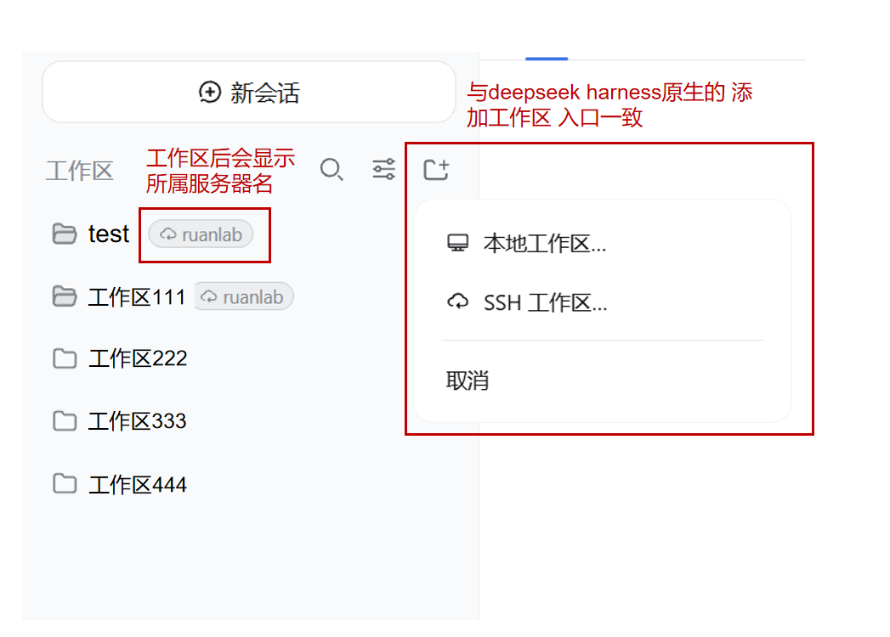
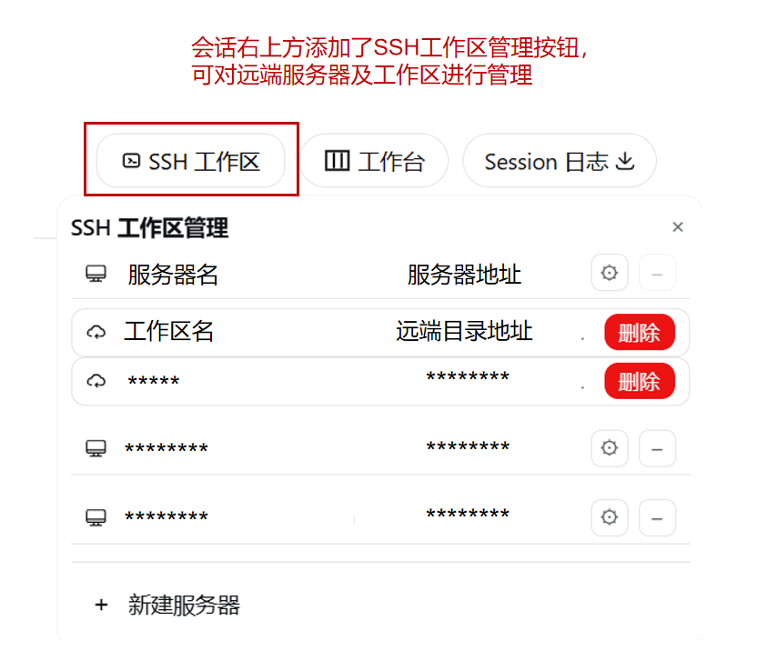

# dsh-hardssh

[](CHANGELOG.md)
[](LICENSE)
[](https://github.com/topics/dsh-plugin)

**中文** · [English](./README.en.md)

**【DeepSeek Harness (DSH) 的 SSH 工作区 + SSH 运维插件】**

## 界面预览

<div align="center">
  
  <p><em>把服务器上的目录变成工作区：会话内的文件读写、命令执行透明路由到远端主机</em></p>
  
  <p><em>按服务器分组管理 SSH 工作区：连接状态、编辑/删除服务器、新建服务器</em></p>
</div>

## 实现原理（seam 替换）

本插件**不修改官方内核**，遵循 DSH 的 cordis 插件理念：通过 `cordis.patch.yml` 将官方
`dsh-fs` / `dsh-subprocess` 等服务的 seam 替换为 `dsh-hardssh` 的「本地/远端」切换实现。
会话绑定 SSH 工作区后，其 `fs` / `subprocess` 调用经 seam **透明路由到远端主机**
（SFTP 读写 + 远端 shell），本地会话保持原样。因此**任何通过标准 fs/subprocess 接口
工作的插件，都能在 SSH 工作区中无需额外适配、直接运行在服务器上**——这是 cordis
依赖注入与 seam 替换带来的天然能力。也正因如此，插件不依赖某个具体内核版本的内部
API，**兼容全版本 dsh 内核**（当前最新内核版本为 `0.1.2-alpha.3`）。

在 DSH Web GUI 中管理若干台 SSH 服务器，把服务器上的任意目录变成 **SSH 工作区**：绑定后，会话内的文件读写、命令执行透明路由到远端主机，你（以及 agent）就像在本机一样操作——同时保留完整的 SSH 运维面板（终端、传输、隧道、集群、主机管理）。

- **SSH 工作区**：任意 `user@host` 的目录即可成为工作区。绑定后该会话的 `fs` / `subprocess` 经过 seam 自动落到远端（SFTP 读写、远端 bash），本地会话不受影响。
- **SSH 运维**：侧边栏「SSH」面板 —— Web 终端（xterm + WebSocket PTY）、文件上传下载（SFTP）、本地端口隧道（访问内网数据库/服务）、集群并发执行、主机增删改查与 `~/.ssh/config` 导入、连接测试。
- **Agent 工具**：`ssh_list` / `ssh_exec` / `ssh_upload` / `ssh_download` / `ssh_tunnel` / `ssh_cluster`，以及 `remote_*` 工作区工具，供 agent 直接操作远端。
- **安全默认值（VSCode Remote-SSH 式）**：密码/密钥口令默认**不落盘**（`secretStorage: none`）；首次连接或浏览远端目录时弹窗输入一次，会话内复用；需要无人值守时可显式启用 `vault` 加密存储。主机密钥采用 TOFU 校验（首次指纹确认，变更即告警，防中间人）。
- **通用底座**：工作区管理底层（WorkspaceLedger / Provider / Registry / Router / WFS）与 SSH 解耦，其他插件可复用同样的「本地/远端工作区」模型。

## 特性

- **多服务器**：任意数量的主机（`host` / `port` / `user` + 私钥或密码或 `SSH_AUTH_SOCK` agent），密码免提交、连接时输入。
- **SSH 工作区**：添加工作区 → 选主机 → 浏览远端目录（可边浏览边选中）→ 命名创建；绑定的会话透明远端路由，侧边栏工作区带服务器标识（已连接蓝色、未连接灰色，悬停显示远端目录）。
- **Web 终端**：xterm + WebSocket PTY，与连接池复用（空闲 30 分钟自动断开）。
- **文件传输 / 隧道 / 集群**：SFTP 上传下载、本地端口转发（`127.0.0.1`）、多主机并发命令。
- **主机管理**：新建/编辑/删除（删除受「仍有工作区」保护）、`~/.ssh/config` 导入、一键测试连接。
- **安全**：
  - 凭据策略 `secretStorage`：`none`（默认，VSCode 式，密码仅会话内存）或 `vault`（AES-256-GCM + scrypt 加密存储，供无人值守 agent）。
  - 主机密钥 TOFU：`~/.dsh/ssh-known-hosts.json`，首次连接弹指纹确认，密钥变更弹「重置/信任」。
  - 会话密码表：连接、测试、浏览目录时若缺密码，弹窗输入一次后会话内复用；进程重启后重新输入。
- **数据位置**：主机配置 `~/.dsh/dsh-ssh.json`；工作区台账与锚点 `~/.dsh/ssh-workspaces`；以上文件按系统权限（0600）落盘。
- **不修改官方内核**：只作为普通插件挂载（目录流、会话头按钮、侧边栏入口），`dsh-workspace` 内核原样工作。

## 安装

已发布到 npm（稳定线 `0.1.2`，开发线 `0.1.2-alpha`；均含插件所需的 `cordis.patch.yml` 与构建产物），一行安装：

```sh
dsh plugin --profile web add @tiphareth/dsh-hardssh
# 或 npx 形式（dsh 不在 PATH 时）
npx --yes @deepseek-ai/dsh plugin --profile web add @tiphareth/dsh-hardssh
```

开发/迭代用本机源码或本地 tarball：

```sh
dsh plugin --profile web add C:/Users/Kether/.dsh/dsh-hardssh/dist/tiphareth-dsh-hardssh-0.1.2.tgz
# 或源码链接（改代码重建 lib/ 后重启即生效，无需重新打包）
dsh plugin --profile web add link:C:/Users/Kether/.dsh/dsh-hardssh/packages/dsh-hardssh
```

NPM 包页面：https://www.npmjs.com/package/@tiphareth/dsh-hardssh

或手工方式：把包加入 profile 的 `dependencies`（`file:...` 指向 tarball）与
`dsh.profile.bundles` 列表，重启 `dsh web` 生效。

> 兼容全版本 dsh 内核（当前最新内核版本为 `0.1.2-alpha.3`；seam 替换机制见上文「实现原理」，无需按内核版本做适配）。

## 快速开始

1. **添加主机**：SSH 面板 → 新建服务器，填别名/主机/端口/用户名——**密码可留空**（新增不会连接，首次使用时再输入）。
2. **添加 SSH 工作区**：侧边栏「添加工作区」→ SSH 工作区 → 选服务器 → 浏览远端目录（首次会自动弹出连接：未信任则先确认主机指纹，随后输入一次密码）→ 命名创建。
3. **开始操作**：在工作区会话里读写文件、运行命令即是远端执行；侧边栏工作区出现远端目录标识。也可以在 SSH 面板开终端、传文件、开隧道、跑集群。

## 配置

| Key | Type | Default | 含义 |
| --- | --- | --- | --- |
| `announceToAgent` | boolean | — | 是否向 agent 注入 SSH 系统提示与工具引导 |
| `enabled` | boolean | — | 插件总开关 |
| `secretStorage` | enum | `none` | 凭据策略：`none` = 密码不落盘、连接时输入（VSCode Remote-SSH 式）；`vault` = 加密存储（供无人值守 agent） |

示例（`cordis.patch.yml`）：

```yaml
- id: hardssh
  name: dsh-hardssh
  config:
    secretStorage: none   # 或 vault
```

## 开发

```sh
pnpm install
pnpm --filter @tiphareth/dsh-hardssh typecheck   # 类型检查
pnpm --filter @tiphareth/dsh-hardssh exec vitest run   # 测试
pnpm --filter @tiphareth/dsh-hardssh build       # 构建（lib/ 产物）
```

打包部署：`pnpm --filter @tiphareth/dsh-hardssh pack --pack-destination dist`，
将 tarball 装入 profile（`pnpm add file:...`）后重启 `dsh web`。

## FAQ

**连接时要求输入密码 / 提示“需要密码”** —— 安全默认不保存密码：首次连接、测试、浏览远端目录时会弹窗输入一次，本会话内复用；进程重启后重新输入。

**主机密钥变化 / 提示可能中间人** —— 服务器重装或轮换密钥：SSH 面板 → 主机 → 测试触发指纹弹窗 → 「重置」后重新信任。

**加了服务器但浏览目录失败** —— 确认该主机配置正确；首次浏览会先完成「信任指纹 + 输入密码」，之后即可浏览。

**工作区点击无反应** —— 点击时会自动完成连接（指纹/密码弹窗）；若仍失败，看行下横幅提示或到 SSH 面板「测试」查看原因。

**密码存哪里** —— 默认不落盘；启用 `secretStorage: vault` 后加密存储于 `~/.dsh/dsh-ssh-vault.json`。

## 安全说明

插件持有主机凭据后，agent 可以以你的身份在远端执行命令。请只添加你信任的机器。
默认策略下密码不写入磁盘（仅在会话内存中存在）；主机密钥采用 TOFU 首次信任。
如需无人值守自动化访问密码主机，再显式启用 `vault` 模式并妥善保管主密码。

## License

BSD-3-Clause

## Changelog

见 [CHANGELOG.md](./CHANGELOG.md)。